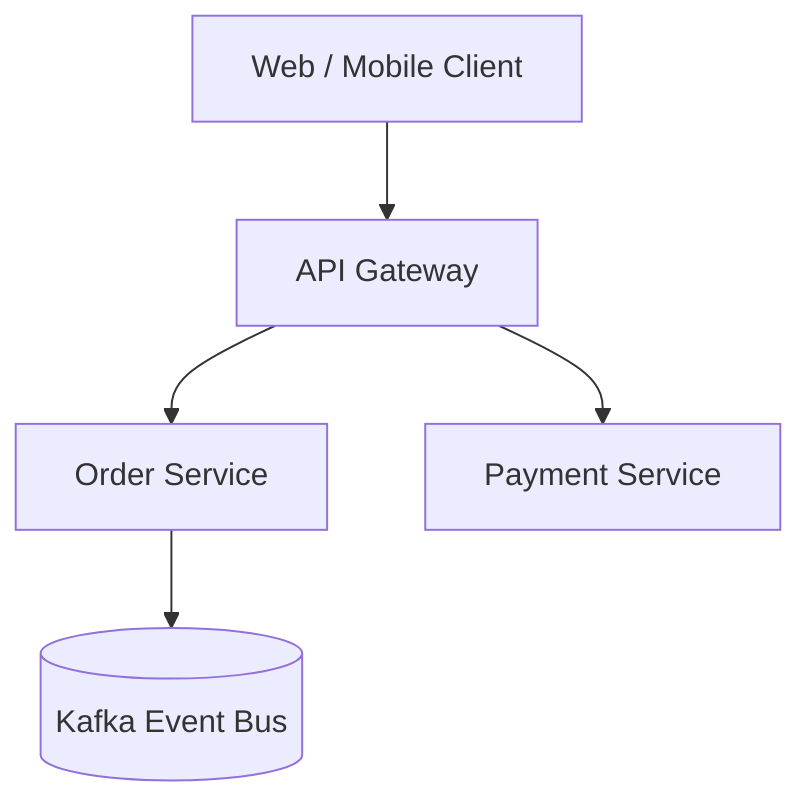

# /draft-rfc

> **Principle 9.1**: Agents for everything — Architecture Design.  
> *"Design docs that used to take a week now take an afternoon."*  
> **Source**: [kiro.dev/topics/frontier-engineering/agents-for-everything](https://kiro.dev/topics/frontier-engineering/agents-for-everything/)

## Purpose & Objective
"Do one thing and do it best": `/draft-rfc` turns an architecture proposal or major feature idea into a comprehensive, high-quality **Technical RFC / Architecture Design Document** (`docs/rfc/XXXX-<title>.md`).
It conducts repository research, generates system topology diagrams, outlines API schemas, analyzes technical tradeoffs, and defines migration phases.

## When to Reach for It
- Before kicking off a multi-week engineering effort or major refactor.
- When you need to communicate a technical proposal to team leads or stakeholders.
- Triggered by typing `/draft-rfc <proposal title or problem statement>`.

## Standalone & Synergy Characteristics
- **Standalone**: Scans the codebase, analyzes existing schemas, and outputs standard Markdown RFCs with Mermaid diagrams.
- **Synergy with Frontier Suite**: Elevates requirements captured via `/write-intent` into full technical architecture proposals, defining the schema contracts and migration strategies before launching `/let-it-cook`.

---

## Output RFC Structure

Generated at `docs/rfc/XXXX-[title-slug].md`:
```markdown
# RFC-0014: [Title of Proposal]

- **Status**: Draft | Proposed | Accepted
- **Author**: [Author Name]
- **Date**: YYYY-MM-DD

## 1. Executive Summary & Problem Statement
Concise statement of the problem, motivation, and why existing architecture falls short.

## 2. System Architecture & Component Diagram


## 3. Detailed Design & API Contracts
Request/response schemas, database migrations, data consistency models.

## 4. Architectural Tradeoffs & Alternatives Considered
- **Option A (Chosen)**: Why chosen, pros and cons.
- **Option B (Rejected)**: Why rejected.

## 5. Migration, Rollout & Rollback Strategy
Step-by-step phased rollout with zero downtime.

## 6. Security, Compliance & Observability
Metrics, alerts, audit logging, and authorization boundaries.
```
